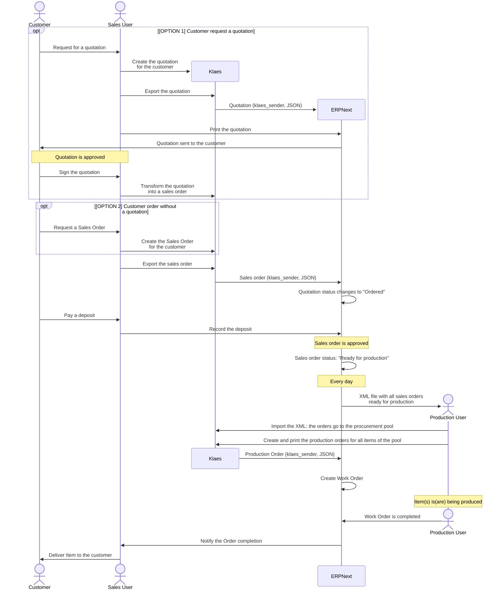

```mermaid
sequenceDiagram
    
	
    actor C as Customer
	
    create actor SU as Sales User
    opt [OPTION 1] Customer request a quotation
	    C->>SU: Request for a quotation
	    create participant K as Klaes
	    SU->>K: Create the quotation<br/>for the customer
	    SU->>K: Export the quotation
	    create participant E as ERPNext
	    K->>E: Quotation (klaes_sender, JSON)
	    SU->>E: Print the quotation
	    E->>C: Quotation sent to the customer
	
	    note over C,SU: Quotation is approved
	
	    C->>SU: Sign the quotation
	    SU->>K: Transform the quotation<br/>into a sales order
	end
	opt [OPTION 2] Customer order without a quotation
		C->>SU: Request a Sales Order
		SU->>K: Create the Sales Order<br/>for the customer  
	end
    SU->>K: Export the sales order
    K->>E: Sales order (klaes_sender, JSON)
    E->>E: Quotation status changes to "Ordered"
    C->>SU: Pay a deposit

    SU->>E: Record the deposit
    note over E: Sales order is approved
	
    E->>E: Sales order status: "Ready for production"


    Note over E: Every day
    create actor PU as Production User
    E->>PU: XML file with all sales orders<br/>ready for production
    PU->>K: Import the XML: the orders go to the procurement pool
    PU->>K: Create and print the production orders for all items of the pool
    destroy K
    K->>E: Production Order (klaes_sender, JSON)
    E->>E: Create Work Order
    
    note over PU: Item(s) is(are) being produced
    destroy PU
    PU->>E: Work Order is completed
    E->>SU: Notify the Order completion
    SU->>C: Deliver Item to the customer
    
```
